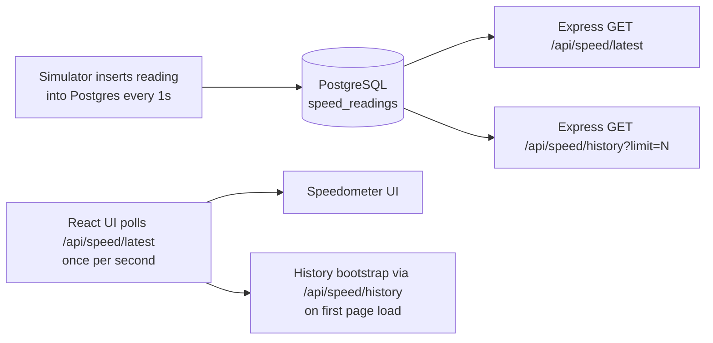

# Speedometer App (Real-time)

## 1) What was built

This is a full-stack Speedometer app that:

- Generates a new “sensor” speed reading every 1 second
- Stores readings in PostgreSQL
- Displays speed on the UI in (near) real-time, without page refresh
- Shows a small history chart of the most recent readings
- Runs fully via `docker compose up`

## 2) Stack

- Frontend: React (Vite)
- Backend: Node.js + Express
- Database: PostgreSQL
- Realtime mechanism: browser polling every 1 second (no WebSockets)

## 3) Architecture & data flow



## 4) Database schema

The schema is initialized from `db/01_schema.sql`.

- `speed_readings`
  - `id` (primary key)
  - `speed_kmph` (checked between `0` and `180`)
  - `recorded_at` (defaults to `NOW()`)

## 5) Backend strategy (Node + Express)

The backend runs three responsibilities:

1. **DB connection with startup robustness**
   - `backend/src/db.js` provides `waitForDb()` which retries until Postgres accepts connections.
2. **Simulation**
   - `backend/src/simulator.js` inserts one new reading every 1000ms.
3. **API**
   - `GET /api/speed/latest` returns the most recent row.
   - `GET /api/speed/history?limit=N` returns the latest N rows (oldest-to-newest) for chart bootstrap.

All responses are shaped to keep frontend logic simple:

- Latest: `{ id, speedKmph, recordedAt }`
- History: `{ limit, readings: [{ id, speedKmph, recordedAt }, ...] }`

## 6) Frontend strategy (React polling + SVG UI)

### Real-time updates without refresh

- The UI uses `frontend/src/hooks/usePollingLatest.js` to call:
  - `GET /api/speed/latest` every 1 second
- Each new reading updates:
  - the speedometer needle/value
  - the in-memory history buffer (keeps only the most recent 60 points)

### Cold start / empty UI handling

On first load:

- `frontend/src/App.jsx` fetches:
  - `GET /api/speed/history?limit=60`
- This ensures the chart and speed display are populated immediately.

### Visualization

- `Speedometer` is a pure SVG gauge (`frontend/src/components/Speedometer.jsx`)
- `SpeedHistory` is an SVG polyline chart (`frontend/src/components/SpeedHistory.jsx`)

No external charting/gauge libraries are used.

## 7) Dockerization

Services are defined in `docker-compose.yml`:

- `postgres` runs the schema initialization via `./db:/docker-entrypoint-initdb.d`
- `backend` builds from `backend/` and exposes port `4000`
- `frontend` builds from `frontend/` and exposes port `3000`

Environment variables connect backend to the Postgres container and allow the frontend to know the API base URL.

## 8) How to run

From the repo root:

```bash
docker compose up --build
```

Then open:

- Frontend: `http://localhost:3000`

Sanity checks:

```bash
curl http://localhost:4000/api/speed/latest
curl http://localhost:4000/api/speed/history?limit=10
```

## 9) Files of interest

- Backend:
  - `backend/src/db.js`
  - `backend/src/simulator.js`
  - `backend/src/routes/speed.js`
  - `backend/src/server.js`
  - `backend/src/index.js`
- Frontend:
  - `frontend/src/hooks/usePollingLatest.js`
  - `frontend/src/App.jsx`
  - `frontend/src/components/Speedometer.jsx`
  - `frontend/src/components/SpeedHistory.jsx`

